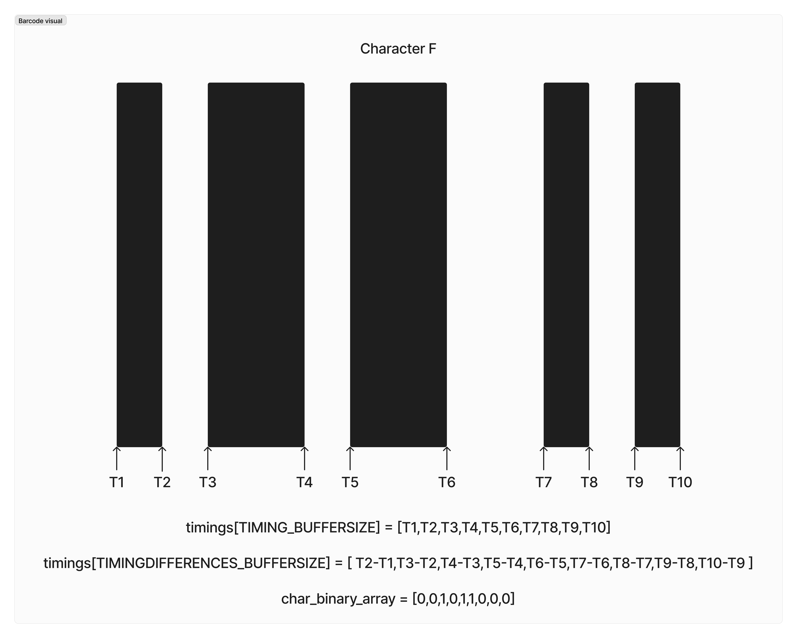
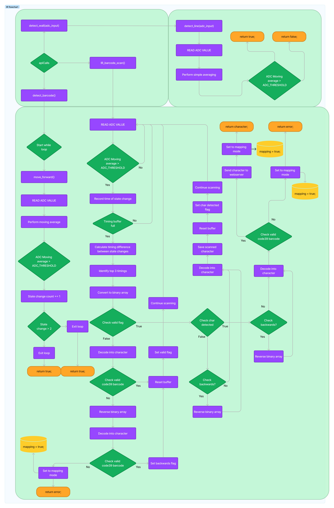

## Infrared Driver Module

### Introduction

This sub-module library contains:

1. Infrared and Barcode Logic `infrared.c`

### Objectives
The objective of the IR Line Tracking Module is to create abstracted functions to allow developers call upon this module to activate bar code scanning functions for the IR Line sensor as well as to activate and scan the surroundings with the relevant IR Line sensor stationed around the car.

### Explanation

This library provides an interface to the infrared sensor through a IR Line Tracking Module driver.

To identify the surroundings of the motor vehicle, IR sensors are placed at the front left and front right of the vehicle which will be used to identify if there are walls around the vehicle. This is done by incorporating motor vehicle movements within the functions to scan multiple directions and populate a directions struct which will be used to map out the maze. 

In addition to identifying the surroundings, the IR sensor will be used to scan barcodes in the maze. To determine the binary output of the barcode which is encoded in code39 format, the absolute time is recorded at each state change from white to black and black to white.



By obtaining the absolute time at each state change, we are able to calculate the timing differences between each state change and identify the large width bars which will be represented as 1 in binary while small width bars which will be represented as 0 in binary.

The obtained binary code from the barcode can thus be converted into the relevant character based on code39.

### Flowchart



### Header Files

Definitions in `infrared.h`:
```c

// GPIO Pin 26 mapped to ADC 0, responsible for scanning the barcode
//
#define IR_PIN_FRONT 26
#define ADC_FRONT 0

// GPIO Pin 27 mapped to ADC 1, to read the status of the Left IR sensor
//
#define IR_PIN_LEFT 27
#define ADC_LEFT 1

// GPIO Pin 28 mapped to ADC 2, to read the status of the Right IR sensor
//
#define IR_PIN_RIGHT 28
#define ADC_RIGHT 2

// Determine the ADC THRESHOLD used to differentiate between white and black lines
//
#define ADC_THRESHOLD 1300

// Define the rate at which the CPU samples the ADC ( in ms )
//
#define SAMPLE_RATE_MS -1

// Define the number of samples used in simple and moving averages
//
#define NUMBER_OF_SAMPLES 10

// Define the array size to capture barcode absolute timings
//
#define TIMING_BUFFERSIZE 10

// Define the array size to capture the timing differences between 2 state
// changes
#define TIMINGDIFFERENCES_BUFFERSIZE 9

// Define the array size to hold a binary code for a character
//
#define BINARYARRAY_BUFFERSIZE 9

// Define the array size to hold code39 structs, each holding a character
//
#define CODE39BUFFER 43

// Define the struct to hold the directions, each direction holds a value
// whether a line is present ( true ) or not ( false )
//
typedef struct {
    int currentlyFacing;
    bool north;
    bool south;
    bool east;
    bool west;
} Directions;

// Define the struct to hold a binary array and it's relevant character
//
typedef struct {
    int binary[9];
    char character;
} Code39Mapping;

// Function to initialize ADC functions, and all GPIO pins for adc functions
//
void IR_init();

// Helper function to read from an adc input, and check whether the sensor is 
// on a line or not
// 
bool detect_line(int adc_input);

// Function to detect if front wall is a line or barcode
//
bool detect_barcode();

// Function to read the IR sensor based on the direction the motor vehicle is 
// currently facing and populate the relevant directions ( North, South, East , West )
//
Directions* get_directions(int currentlyFacing);

// Function to start scanning mode
//
char IR_barcode_scan();

// Helper function to calculate the timing difference between 2 timings based
// on a given array and use the results to populate another array
//
void calculate_timing_difference(float timings[], float timing_differences[]);

// Helper function to find the top 3 timings in an array
//
void find_top_three_timings(float arr[], float *first, float *second, float *third);

// Helper function to convert the timing_differences array to a binary array
//
void form_binary_array(float timing_differences[], int char_binary_array[], float first, float second, float third);

// Helper function to print an array
//
void print_array(int arr[]);

// Helper function to decode a binary array into it's relevant character using
// code39 format
//
char decode_array(int char_binary_array[]);

// Helper function to reverse a given array
//
void reverse_array(int arr[]);

```